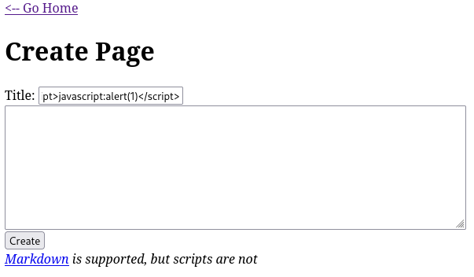
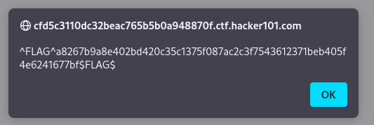
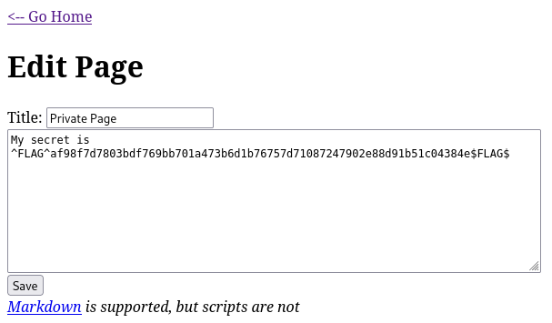
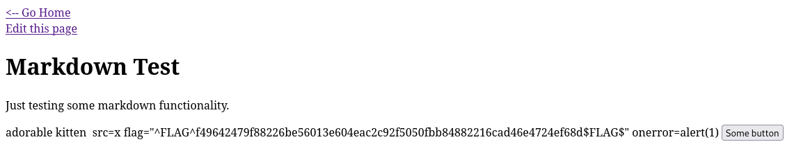

# Easy Level

### Name: Micro-CMS v1
#### Solution Challenge 1: 

By creating a page and filling it with the payload `<script>javascript:alert(1)</script>`:



Simply go to the homepage of the site and the flag will appear.



#### Solution Challenge 2: 

When you create a page, you will notice that the URL contains an ID like `https://ctf.hacker101.com/page/10`, suggesting that there are other unlisted URLs. The next step is to validate each of these IDs to see their content. Most bring up a **Not Found** error, but upon encountering a certain number, you receive a **Forbidden** message. However, when trying to edit `https://ctf.hacker101.com/page/edit/7`, the flag appears:



#### Solution Challenge 3:

Testing payloads directly in the URL also reveals a flag `https://ctf.hacker101.com/page/edit/11'`. Just a single quote is enough, and the flag is returned.

```
^FLAG^a20251929a86e0a07f566f77ad158c69b48f12b395e15a6720694f275ce4dfcf$FLAG$
```

#### Solution Challenge 4:

When editing a page, it can be observed that the `<script>` tag does not work where the text is entered, but the filter does not apply to the `` tag. Therefore, the payload `` will work and the flag will be obtained.

